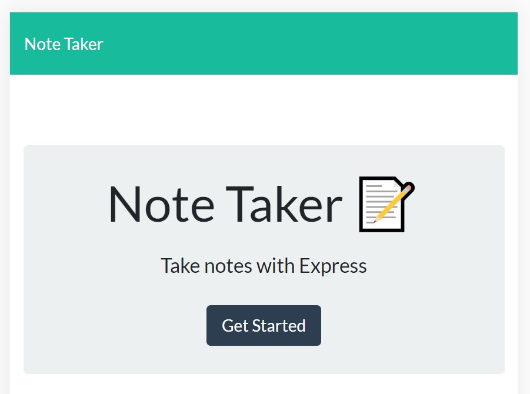
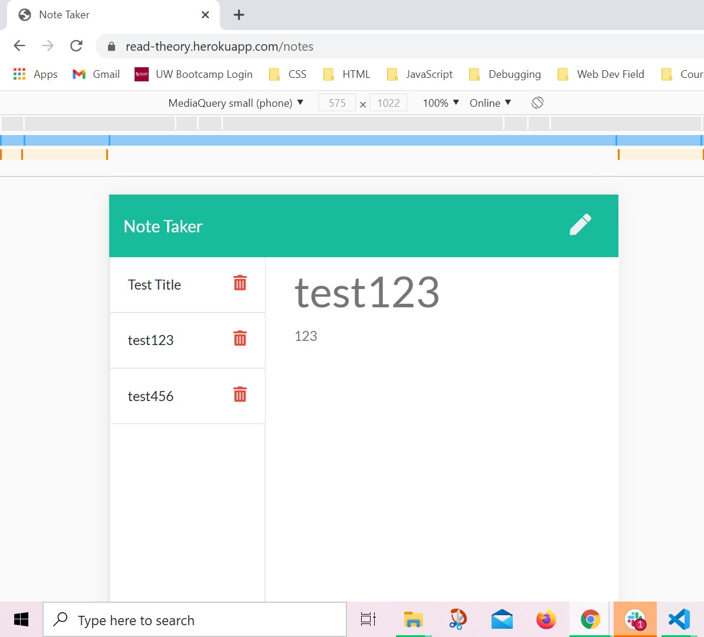

# Note Taker "readTheory" Starter Code

## Description
This app will allow the user to write and save notes to assist with task-tracking and the organizing of one's thoughts.

### Languages used:
- HTML
- CSS
- JavaScript
- Node
- ES6    

## <a name="usage">Usage</a>:

https://github.com/SMKrizan/readTheory

[*Screenshot of landing page*]
[*Screenshot of working notes page*]

    
## <a name="contribution-guidelines">Contribution Guidelines</a>:
Made with ☕+❤️ by Sara Krizan and in consultation with several LAs, TA, and learning instructor through the University of Wisconsin Extended Campus Coding Bootcamp.

## <a name="questions?">Questions?</a>
Sara Krizan
[GitHub](https://github.com/SMKrizan)